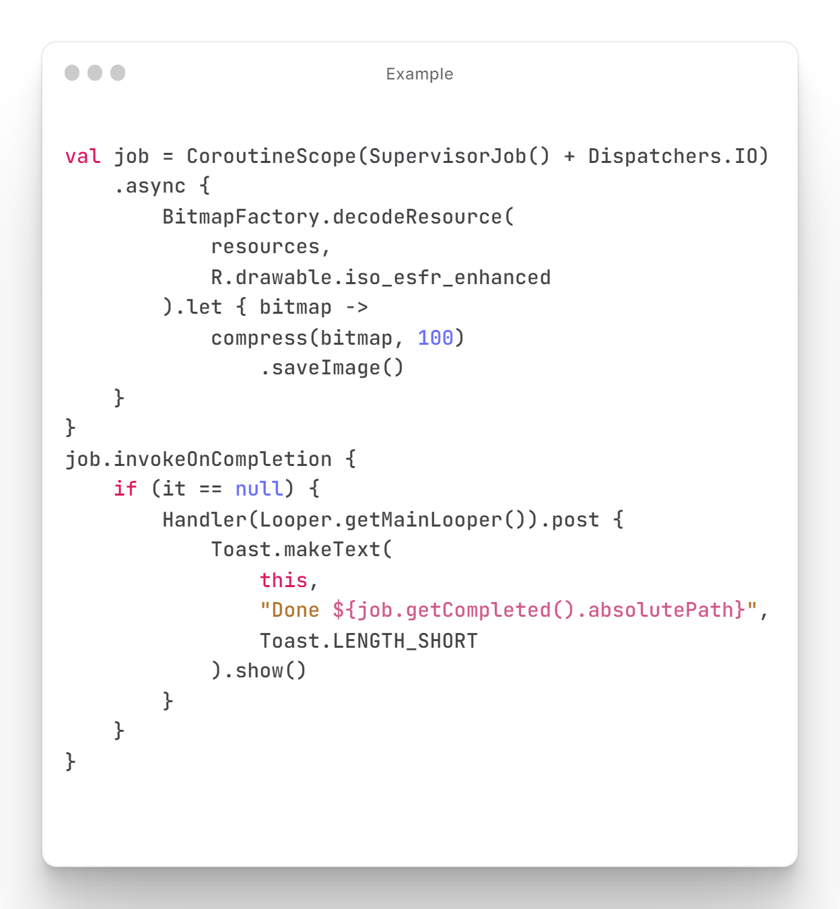
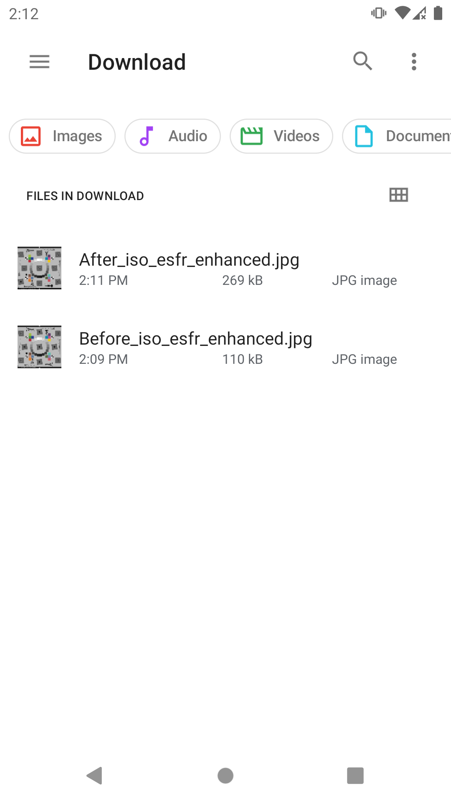

## LibJpegTurboAndroid - cross-compiled libjpeg-turbo for android

### About

This is a demo project for integrating **libjpeg-turbo** as a library on Android.
**libjpeg-turbo** has been cross-compiled as shared libraries `(.so)` and C and Java Native Interface (JNI) to communicate through the app.<br />

* Built with the latest repository of [libjpeg-turbo]("https://github.com/libjpeg-turbo/libjpeg-turbo/releases")

### Implementation

Navigate to the project dir and simply copy paste the [:turbojpeg](turbojpeg) module to which project you want to import and don't
forget to include the module to your project. <br />
Set `include ':turbojpeg'` in `settings.gradle` file. See [settings.gradle](settings.gradle) if you don't get it clearly...

```kotlin
pluginManagement {
    repositories {
        //..../
    }
}
dependencyResolutionManagement {
    repositoriesMode.set(RepositoriesMode.FAIL_ON_PROJECT_REPOS)
    repositories {
        //..../
    }
}
//..../
//..../
include ':turbojpeg' // <- turbojpeg module 
```

After including the turbojpeg module. Setup the [AndroidManifest.xml](app/src/main/AndroidManifest.xml)

```xml
<application android:extractNativeLibs="true"/>
```

### Example usage

Need a knowledge about libjpeg-turbo configuration to perform actions/tasks. Go and see their docs [Documents](https://libjpeg-turbo.org/Documentation/Documentation)<br />
For more example/information [MainActivity.kt](app/src/main/java/com/mrkazofficial/libjpegturbo/MainActivity.kt)

<div align="center">
	
</div>

* Screen-shot
<div align="center">
	
</div>

### Compiling

soon...

### Credits

- [libjpeg-turbo]("https://github.com/libjpeg-turbo/libjpeg-turbo")

### License

##### Distributed under the Apache License. See [`LICENSE`](LICENSE) for more information

* [Project license](LICENSE)
* [libjpeg-turbo license](https://github.com/libjpeg-turbo/libjpeg-turbo/blob/main/LICENSE.md)

```
Copyright 2023 Kasun Gamage

Licensed under the Apache License, Version 2.0 (the "License");
you may not use this file except in compliance with the License.
You may obtain a copy of the License at

   https://www.apache.org/licenses/LICENSE-2.0

Unless required by applicable law or agreed to in writing, software
distributed under the License is distributed on an "AS IS" BASIS,
WITHOUT WARRANTIES OR CONDITIONS OF ANY KIND, either express or implied.
See the License for the specific language governing permissions and
limitations under the License.
```
